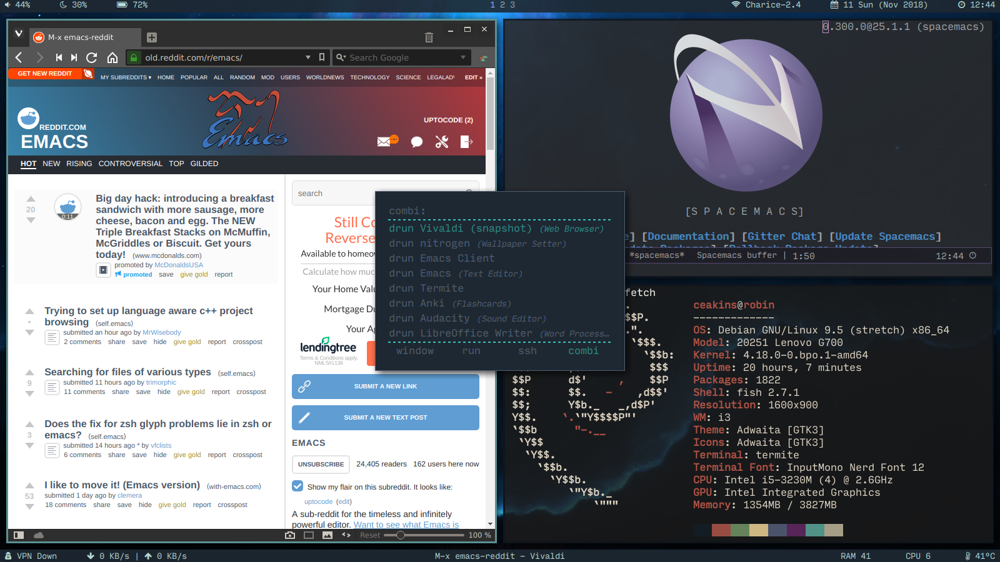
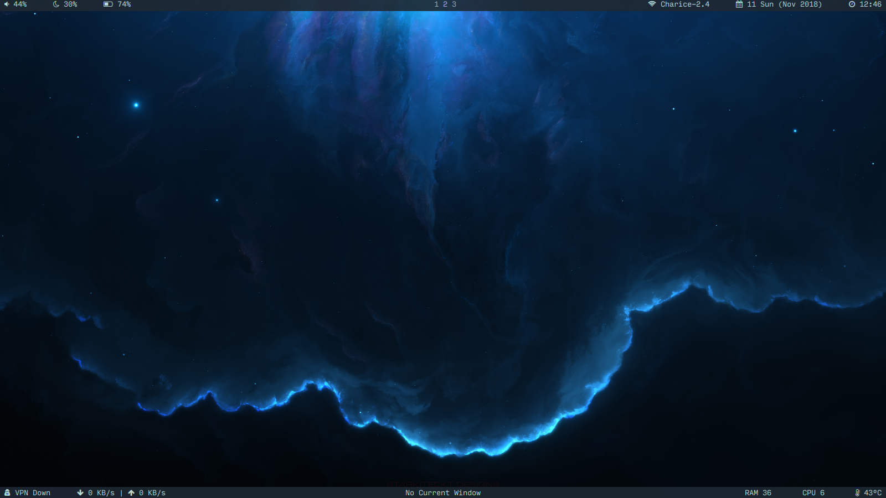

# Dotfiles

## Screenshots

## Packages

i3-gaps
Emacs (Spacemacs)
Termite
Rofi
Polybar
Fish
Compton
Nitrogren
Neofetch

## Font

I used a patched version (using the font-patcher from [Nerd Fonts](https://github.com/ryanoasis/nerd-fonts)) of [Input Mono](http://input.fontbureau.com) to include icons that the font does not include normally.

Due to the license restrictions for the Input font, I cannot distribute the font files here. However, you can follow the steps here to download and create the font:

[How to make a Nerd Fonts-patched (‘Powerline’) version of the Input Mono font
](https://gist.github.com/ELLIOTTCABLE/5b87ab21b11acb76a5c52d47a022b519)

## Wallpaper

Wallpaper courtesy of [Starkiteckt Designs](https://www.artstation.com/starkiteckt). The artist allows for all artwork to be used as desktop wallpapers free of charge.

